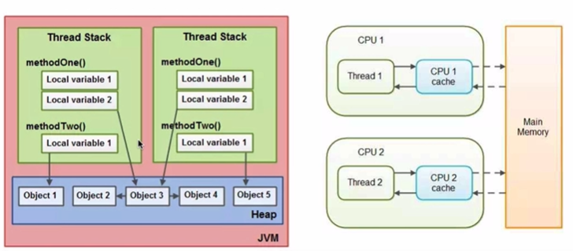
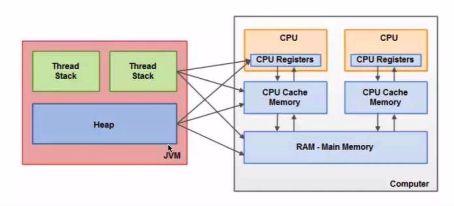
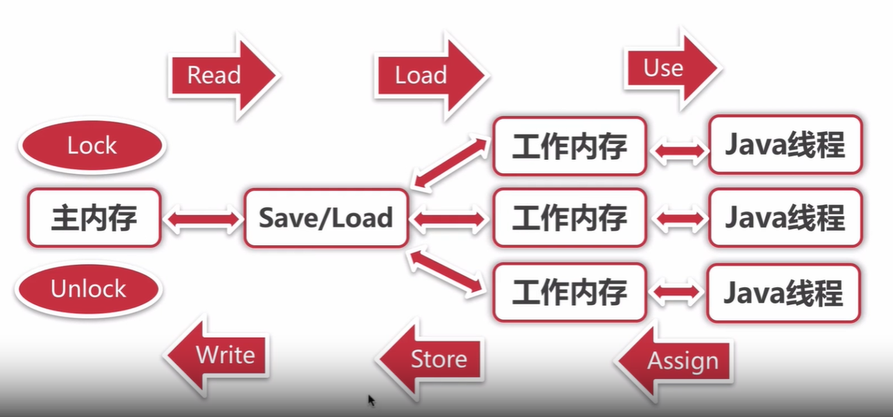

# Java 多线程

## Java内存模型(Java Memory Model)JMM
Java内存模型规定了一个线程如何和何时能看到由其他线程修改后的变量的值，以及在必须时如何同步的访问共享变量。



tips：
* 如果多个线程同时调用同一个对象的方法，都会访问同一个成员变量，每个对象都会持有一个成员变量的私有拷贝。

JMM-同步的八种操作

* lock(锁定): 作用于主内存的变量，将一个变量标识为一个线程的独占状态。
* unlock(解锁)：作用于主内存的变量，把一个处于锁定状态的变量释放出来，释放后的变量才可以被其它线程锁定。
* read(读取)：作用于主内存的变量，把一个变量值从主内存传输到线程的工作内存中，以便随后的load动作使用。
* load(载入)：作用于工作内存的变量，把read操作从主内存中得到的变量值放入到工作内存的变量副本中。
* use(使用)：作用于工作内存的变量，把工作内存中的一个变量值传递给执行引擎。
* assign(赋值)：作用于工作内存的变量，把一个从执行引擎接收到的值赋值给工作内存的变量。
* store(存储)：作用于工作内存的变量，把工作内存中的一个变量的值传送到主内存中，以便随后的write操作。
* write(写入)：作用于主内存的变量，它把store操作从工作内存中的一个变量的值传送到主内存的变量中。

同步规则：

* 如果要把一个变量从主内存复制到工作内存，就需要按顺序的执行read和load操作，如果把变量从工作内存写入到主内存，就需要按顺序的执行store和write操作。但Java内存模型只需要上述操作必须按顺序执行，而没有保证必须是连续执行的。
* 不允许read和load、store和write操作之一单独出现。

* 不允许一个线程丢弃掉最近的assign操作，线程修改了变量之后必须把数据同步回内存。

* 不允许一个线程五原因的没有执行过任何操作就把工作内存同步给主内存。

* 不允许一个线程直接使用未初始化的变量，即没有进行过load或者assign操作的内存。对于一个变量在执行use和store操作之前必须先执行了assign动作和load动作

* 一个变量在同一事件只允许一个线程对其进行lock操作，lock可以被同一个线程执行多次，但是必须执行同样次数的unlock操作，当前变量才能解锁。

* 如果一个变量执行了lock操作，将会清空工作内存中的变量，执行引擎在使用这个变量之前，需要再次执行read,load。

* 如果一个变量实现没有对lock锁定，不允许对其进行unlock操作。也不允许执行unlock一个被其他线程lock的变量。

* 对一个变量执行unlock之前必须将其同步回主内存store，write。




## 线程安全性

* 原子性：提供了互斥访问，同一时刻只能有一个线程来对他进行操作。
* 可见性：一个线程对主内存的修改可以及时的被其他线程所观察到。
* 有序性：一个线程观察其他线程中的指令顺序，由于指令重排序的存在，该观察结果一般杂乱无序。

## 可见性

1. 导致共享变量在线程间不可见的原因
    * 线程交叉执行
    * 重排序结合线程交叉执行
    * 共享变量更新后的值没有在工作内存与主存间及时更新

2. JMM 关于synchronized的两条规定：
    * 线程解锁前，必须把共享变量的最新值刷新到主存。
    * 线程加锁时，将清空工作内存中共享变量的值，从而使用共享变量时需要从主内存中重新读取最新的值（注意，枷锁与解锁是同一把锁）
3. volatile
    
    通过加入内存屏障和禁止重排序优化来实现
    * 对volatile变量写操作时，会在写操作后加入一条store屏障指令，将本地内存中的共享变量值刷新到主内存。
    * 对volatile变量读操作时，会在读操作前加入一条load屏障指令，从主内存中读取共享变量。

    * volatile写
    ```shell
    普通读 -> 普通写 -> StoreStore屏障 -> Volatile写 -> StoreLoad屏障
    ```

    StoreStore 禁止下面的普通写和下面的volatile写重排序。
    StoreLoad 防止上面的volatile写和下面可能有的volatile读/写重排序。

    * volatile读
    ```shell
    volatile读 -> LoadLoad屏障 -> LoadStore屏障 -> 普通读 -> 普通写
    ```
    LoadLoad屏障禁止下面所有普通读操作和上面的volatile读重排序
    LoadStore屏障禁止下面所有的写操作和上面的volatile读操作进行重排序

## 有序性

* Java 内存模型中，允许编译器和处理器对指令进行重排序，但是重排序过程不会影响到单线程程序的执行，却会影响到多线程并发执行的正确性。
* 可以通过 volatile、synchronized、Lock来保证有序性

### happens-before原则
* 程序次序规则：一个线程内，按照代码循序，书写在前面的操作先行发生于书写在后面的操作。
* 锁定规则：一个unLock操作先行发生于后面对同一个锁的lock操作
* volatile变量规则：对一个变量的写操作先行发生于后面对这个变量的读操作。
* 传递规则：如果操作A先行发生于操作B，而操作B又先行发生于操作C，则可以得出操作A先行发生于操作C。
* 线程启动规则：Thread对象的start()方法先行发生于此线程的每一个操作。
* 线程中断规则：对线程interrupt()方法的调用先行发生于被中断线程的代码检测到中断事件的发生。
* 线程终结规则：线程中所有的操作都先行发生于线程的终止检测，我们可以通过Thread.join()方法结束、Thread.isAlive()的返回值手段检测到线程已经终止执行。
* 对象终结规则：一个对象的初始化完成先行发生于他的finalize()方法的开始
